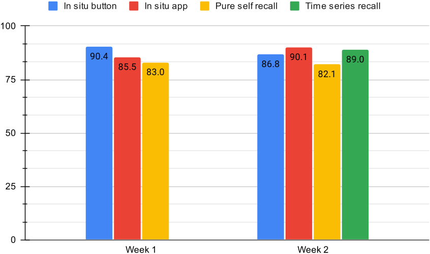

The Deep Learning Architecture is based on the one published by Hoelzemann et al. : https://github.com/ahoelzemann/deepconvlstm_keras.

Please cite the paper linked in the repository if you decide to work with that archecture.

However, we further developed the dataloader and preprocessing and visualized the results using Weights & Biases. 

Please contact me if you have further questions regarding the code: alexander.hoelzemann@uni-siegen.de

